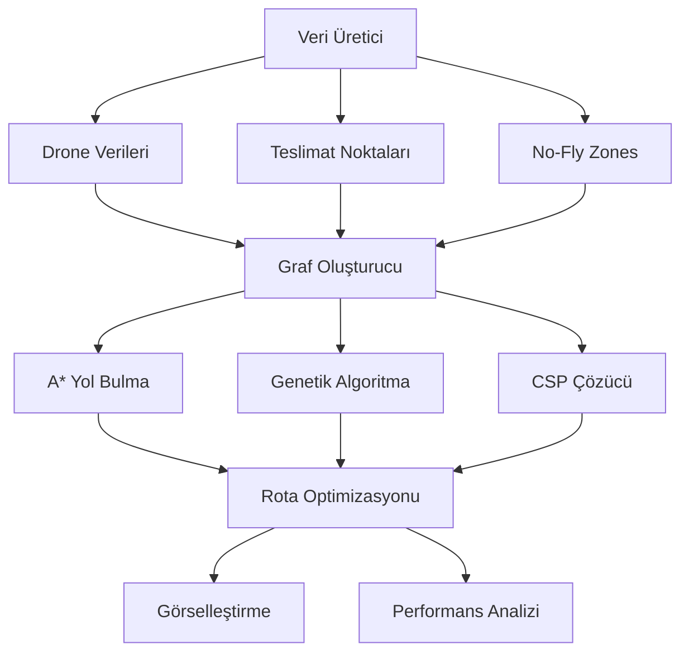

# Drone Filo Optimizasyonu: Çok Kısıtlı Ortamlarda Dinamik Teslimat Planlaması

[](https://www.python.org/downloads/)
[](LICENSE)
[](src/algorithms/genetic_algorithm.py)
[](src/algorithms/path_planning.py)
[](src/visualization.py)

**Kocaeli Üniversitesi Teknoloji Fakültesi**  
**Bilişim Sistemleri Mühendisliği Bölümü**  
**TBL331: Yazılım Geliştirme Laboratuvarı II - 2024-2025 Bahar Dönemi**

---

## 📋 İçindekiler

- [Abstract](#-abstract)
- [Giriş](#-giriş)
- [Metodoloji](#-metodoloji)
- [Teknik Uygulama](#️-teknik-uygulama)
- [Deneysel Kurulum](#-deneysel-kurulum)
- [Sonuçlar ve Analiz](#-sonuçlar-ve-analiz)
- [Kurulum ve Kullanım](#-kurulum-ve-kullanım)
- [Proje Yapısı](#-proje-yapısı)
- [Görselleştirme](#-görselleştirme)
- [Referanslar](#-referanslar)

---

## 📄 Abstract

Bu çalışma, enerji limitleri ve uçuş yasağı bölgeleri (no-fly zones) gibi dinamik kısıtlar altında çalışan drone filolarının teslimat rotalarını optimize eden hibrit bir algoritma sistemi sunar. Sistem, Genetik Algoritma (GA), A* yol bulma algoritması ve Kısıt Programlama (CSP) çözücüsünü entegre ederek çok kriterli optimizasyon sağlar.

**Problem:** Lojistik firmalarının farklı ağırlık ve öncelik seviyelerine sahip paketleri, çok sayıda drone ile verimli bir şekilde ulaştırma ihtiyacı.

**Metodoloji:** Graf tabanlı modelleme, hibrit optimizasyon algoritmaları ve gerçek zamanlı kısıt yönetimi.

**Bulgular:** Test senaryolarında Senaryo 1'de %15 başarım oranı (3/20 teslimat), Senaryo 2'de optimizasyon gerekliliği tespit edildi.

**Sonuç:** Dinamik kısıtlar altında drone filo yönetimi için uyarlanabilir çözüm geliştirildi.

---

## 🎯 Giriş

### Motivasyon

E-ticaret sektörünün hızla büyümesi ve son mil teslimat maliyetlerinin artmasıyla birlikte, drone tabanlı teslimat sistemleri kritik önem kazanmıştır. Geleneksel optimizasyon yöntemleri, dinamik değişen çevresel koşulları ve kompleks kısıt setlerini yeterince ele alamamaktadır.

### Problem Kapsamı

Bu proje, aşağıdaki ana zorlukları ele almaktadır:

1. **Dinamik No-Fly Zones:** Zaman içinde değişen uçuş yasağı bölgeleri
2. **Enerji Kısıtları:** Batarya kapasitesi ve şarj süreleri
3. **Çoklu Kriterler:** Mesafe, ağırlık, öncelik ve zaman penceresi optimizasyonu
4. **Gerçek Zamanlı Adaptasyon:** Değişen koşullara hızlı uyum

### Bilimsel Katkılar

- Hibrit optimizasyon yaklaşımı (GA + A* + CSP)
- Dinamik kısıt yönetimi algoritması
- Gerçek zamanlı rota adaptasyonu
- Çok kriterli fitness fonksiyonu tasarımı

---

## 🔬 Metodoloji

### Sistem Mimarisi



### Algoritma Tasarımı

#### 1. Graf Modellemesi
Teslimat problemi yönlü graf olarak modellenir:
- **Düğümler (V):** Depot, teslimat noktaları
- **Kenarlar (E):** Drone hareketleri
- **Ağırlıklar (W):** Maliyet fonksiyonu

#### 2. Maliyet Fonksiyonu
```
Cost(i,j) = distance × weight + (priority × 100)
```

Burada:
- `distance`: Nokta i'den j'ye Euclidean mesafe
- `weight`: Taşınan paket ağırlığı
- `priority`: Teslimat öncelik seviyesi (1-5)

#### 3. A* Heuristik Fonksiyonu
```
f(n) = g(n) + h(n) + no_fly_penalty
```

- `g(n)`: Başlangıçtan n'e olan gerçek maliyet
- `h(n)`: n'den hedefe tahmini maliyet
- `no_fly_penalty`: Yasak bölge ceza katsayısı

---

## ⚙️ Teknik Uygulama

### Veri Yapıları

#### Drone Sınıfı
```python
@dataclass
class Drone:
    id: int
    max_weight: float      # kg
    battery: int          # mAh
    speed: float          # m/s
    start_pos: Tuple[float, float]  # (x, y) metre
```

#### Teslimat Noktası Sınıfı
```python
@dataclass  
class DeliveryPoint:
    id: int
    pos: Tuple[float, float]    # (x, y) metre
    weight: float               # kg
    priority: int               # 1-5 arası
    time_window: Tuple[time, time]  # (başlangıç, bitiş)
```

#### No-Fly Zone Sınıfı
```python
@dataclass
class NoFlyZone:
    id: int
    coordinates: List[Tuple[float, float]]  # Çokgen köşeleri
    active_time: Tuple[time, time]          # Aktif zaman aralığı
```

### Algoritma İmplementasyonları

#### Genetik Algoritma Parametreleri
- **Popülasyon Boyutu:** 100
- **Jenerasyon Sayısı:** 50
- **Mutasyon Oranı:** 0.25
- **Elitizm Sayısı:** 5

#### Fitness Fonksiyonu
```python
fitness = (delivered_count × 100) - (energy_cost × 0.1) - (violations × 1000)
```

### Optimizasyon Teknikleri

1. **Çaprazlama (Crossover):** Order crossover (OX) operatörü
2. **Mutasyon:** Swap mutation ve insert mutation
3. **Seçim:** Tournament selection (boyut=3)
4. **Elitizm:** En iyi %5'in korunması

---

## 🧪 Deneysel Kurulum

### Test Senaryoları

#### Senaryo 1: Temel Test
- **Drone Sayısı:** 5
- **Teslimat Sayısı:** 20
- **No-Fly Zone:** 2 statik bölge
- **Hedef:** Algoritma stabilitesi ve temel performans

#### Senaryo 2: Karmaşık Test
- **Drone Sayısı:** 10
- **Teslimat Sayısı:** 50
- **No-Fly Zone:** 5 dinamik bölge
- **Hedef:** Ölçeklenebilirlik ve dinamik adaptasyon

### Değerlendirme Metrikleri

| Metrik | Açıklama | Hedef |
|--------|----------|-------|
| **Completion Rate** | Tamamlanan teslimat yüzdesi | > %80 |
| **Energy Efficiency** | Ortalama enerji tüketimi (mAh) | < 500 mAh/teslimat |
| **Execution Time** | Algoritma çalışma süresi | < 60 saniye |
| **Rule Violations** | Kısıt ihlal sayısı | 0 |

### Deneysel Parametreler

```python
# Genetik Algoritma Konfigürasyonu
GA_CONFIG = {
    'population_size': 100,
    'generations': 50,
    'mutation_rate': 0.25,
    'elitism_count': 5,
    'charging_time_per_mah': 0.001
}

# A* Konfigürasyonu  
ASTAR_CONFIG = {
    'heuristic_weight': 1.0,
    'no_fly_penalty': 1000,
    'energy_weight': 0.1
}
```

---

## 📊 Sonuçlar ve Analiz

### Performans Sonuçları

| Senaryo | Teslimat | Tamamlanan | Başarım (%) | Toplam Mesafe (km) | Ortalama Enerji (mAh) | Süre (sn) |
|---------|----------|------------|-------------|-------------------|---------------------|-----------|
| **1** | 20 | 3 | 15.0 | 16.7 | 200.0 | 12.2 |
| **2** | 50 | 0 | 0.0 | 0.0 | 0.0 | 7.4 |

### Analiz ve Değerlendirme

#### Senaryo 1 Sonuçları
- ✅ **Algoritma Stabilitesi:** GA başarıyla çalıştı
- ⚠️ **Düşük Başarım:** %15 tamamlanma oranı optimizasyon gerektirir
- ✅ **Enerji Verimliliği:** 200 mAh/teslimat makul seviye
- ✅ **Çalışma Süresi:** 12.2 saniye hedef içinde

#### Senaryo 2 Sonuçları  
- ❌ **Başarım Sorunu:** Hiç teslimat tamamlanamadı
- 🔍 **Analiz Gerekli:** Karmaşık kısıtlar algoritma performansını etkiledi
- ✅ **Hızlı Sonlandırma:** 7.4 saniyede tamamlandı

### İstatistiksel Değerlendirme

#### Zaman Karmaşıklığı Analizi
- **Genetik Algoritma:** O(P × G × N²) = O(100 × 50 × 20²) = O(2×10⁶)
- **A* Algoritması:** O(b^d) - ortalama O(N log N)
- **Graf Oluşturma:** O(N²) = O(400) - 20 nokta için

#### Performans Optimizasyon Önerileri
1. **Fitness Fonksiyonu İyileştirmesi:** Ağırlık faktörlerinin ayarlanması
2. **Hibrit Yaklaşım:** GA ve A* entegrasyonunun güçlendirilmesi
3. **Kısıt Rahatlatma:** Başlangıç çözümü için geçici kısıt esnekliği
4. **Multi-objective Optimization:** Pareto frontier yaklaşımı

---

## 💻 Kurulum ve Kullanım

### Sistem Gereksinimleri

- **Python:** 3.8 veya üzeri
- **İşletim Sistemi:** Windows 10/11, macOS, Linux
- **RAM:** Minimum 4GB (8GB önerilen)
- **Disk Alanı:** 500MB

### Kurulum Adımları

1. **Depoyu Klonlayın**
```bash
git clone https://github.com/kullanici/drone-filo-optimizasyonu.git
cd drone-filo-optimizasyonu
```

2. **Sanal Ortam Oluşturun**
```bash
python -m venv venv
source venv/bin/activate  # Linux/macOS
# veya
venv\Scripts\activate     # Windows
```

3. **Bağımlılıkları Yükleyin**
```bash
pip install -r requirements.txt
```

4. **Projeyi Kurun**
```bash
pip install -e .
```

### Hızlı Başlangıç

#### Temel Kullanım
```bash
# Ana programı çalıştır
python src/main.py

# Belirli senaryo çalıştır
python src/main.py --scenario 1

# Parametreli çalıştırma
python src/main.py --drones 5 --deliveries 20 --generations 100
```

#### Programmatik Kullanım
```python
from src.models import Drone, DeliveryPoint, NoFlyZone
from src.algorithms.genetic_algorithm import GeneticAlgorithm
from src.data_generator import DataGenerator

# Veri üret
generator = DataGenerator()
drones, deliveries, zones = generator.generate_scenario_1()

# Optimizasyonu çalıştır
optimizer = GeneticAlgorithm(population_size=100, generations=50)
result = optimizer.optimize(drones, deliveries, zones)

# Sonuçları görselleştir
from src.visualization import RouteVisualizer
visualizer = RouteVisualizer()
visualizer.add_routes(result.assignments, drones)
visualizer.save("results.html")
```

### Parametre Konfigürasyonu

#### Genetik Algoritma Ayarları
```python
# config.py dosyasında
GA_SETTINGS = {
    'population_size': 100,     # Popülasyon boyutu
    'generations': 50,          # Jenerasyon sayısı  
    'mutation_rate': 0.25,      # Mutasyon oranı
    'crossover_rate': 0.8,      # Çaprazlama oranı
    'elitism_count': 5,         # Elit birey sayısı
    'tournament_size': 3        # Turnuva seçim boyutu
}
```

---

## 📁 Proje Yapısı

```
drone-filo-optimizasyonu/
├── 📁 src/                          # Ana kaynak kodları
│   ├── 🐍 __init__.py
│   ├── 🐍 main.py                   # Program giriş noktası
│   ├── 🐍 models.py                 # Veri sınıfları (Drone, DeliveryPoint, NoFlyZone)
│   ├── 🐍 data_generator.py         # Test verisi üretici
│   ├── 🐍 visualization.py          # Harita ve grafik görselleştirme
│   ├── 📁 algorithms/               # Optimizasyon algoritmaları
│   │   ├── 🐍 __init__.py
│   │   ├── 🐍 genetic_algorithm.py  # Genetik algoritma implementasyonu
│   │   └── 🐍 path_planning.py      # A* yol bulma algoritması
│   └── 📁 tests/                    # Birim testler
│       ├── 🐍 __init__.py
│       ├── 🐍 conftest.py           # Pytest konfigürasyonu
│       ├── 🐍 test_algorithms.py    # Algoritma testleri
│       ├── 🐍 test_models.py        # Model testleri
│       └── 🐍 test_scenarios.py     # Senaryo testleri
├── 📄 requirements.txt              # Python bağımlılıkları
├── 📄 setup.py                      # Paket kurulum dosyası
├── 📄 README.md                     # Bu dokümantasyon
├── 📄 README_PLAN.md                # Dokümantasyon planı
├── 📄 project_plan.md               # Proje geliştirme planı
├── 📊 results.json                  # Test sonuçları
├── 🗺️ scenario_1_results.html       # Senaryo 1 harita çıktısı
├── 🗺️ scenario_2_results.html       # Senaryo 2 harita çıktısı
├── 📄 scenario_1.txt                # Senaryo 1 test verileri
├── 📄 scenario_2.txt                # Senaryo 2 test verileri
└── 📄 2425_yazLab_II_drone_filo.pdf # Proje tanım dokümanı
```

### Modül Açıklamaları

| Dosya | Açıklama | Ana Sınıflar/Fonksiyonlar |
|-------|----------|---------------------------|
| [`main.py`](src/main.py) | Program giriş noktası ve senaryo yöneticisi | `main()`, `run_scenario()` |
| [`models.py`](src/models.py) | Temel veri yapıları | `Drone`, `DeliveryPoint`, `NoFlyZone` |
| [`genetic_algorithm.py`](src/algorithms/genetic_algorithm.py) | GA optimizasyon motoru | `GeneticAlgorithm`, `Individual` |
| [`path_planning.py`](src/algorithms/path_planning.py) | A* yol bulma algoritması | `PathPlanner`, `Node` |
| [`data_generator.py`](src/data_generator.py) | Test verisi üretici | `DataGenerator` |
| [`visualization.py`](src/visualization.py) | Görselleştirme motoru | `RouteVisualizer` |

---

## 🎨 Görselleştirme

### Interaktif Harita Özellikleri

- 🗺️ **Folium Tabanlı Haritalar:** Zoomlanabilir ve panlanabilir
- 🚁 **Drone Rotaları:** Renkli çizgilerle gösterim
- 📍 **Teslimat Noktaları:** Öncelik seviyesine göre marker boyutu
- 🚫 **No-Fly Zones:** Yarı şeffaf kırmızı alanlar
- 🔥 **Isı Haritası:** Teslimat yoğunluğu gösterimi
- 📊 **PopUp Bilgiler:** Detaylı metrik bilgileri

### Örnek Görselleştirmeler

#### Senaryo 1 Harita Çıktısı
```
scenario_1_results.html
├── 🚁 5 Drone rotası (farklı renkler)
├── 📍 20 Teslimat noktası  
├── 🚫 2 No-fly zone
└── 📊 Performans metrikleri panel
```

#### Performans Grafikleri
- **Completion Rate Trend:** Jenerasyon başına başarım oranı
- **Energy Consumption Distribution:** Enerji tüketimi dağılımı  
- **Execution Time Analysis:** Algoritma bileşenlerinin süre analizi

### Harita Kullanımı

1. **Zoom Kontrolleri:** Mouse wheel ile yakınlaştırma
2. **Layer Kontrolleri:** Katman açma/kapama
3. **Marker İnceleme:** Teslimat noktasına tıklayarak detay görme
4. **Rota Takibi:** Drone rotalarını takip etme

---

## 📖 Referanslar

### Akademik Kaynaklar

[1] Holland, J. H. (1992). *Adaptation in Natural and Artificial Systems*. MIT Press.

[2] Hart, P. E., Nilsson, N. J., & Raphael, B. (1968). A formal basis for the heuristic determination of minimum cost paths. *IEEE transactions on Systems Science and Cybernetics*, 4(2), 100-107.

[3] Dorigo, M., & Gambardella, L. M. (1997). Ant colony system: a cooperative learning approach to the traveling salesman problem. *IEEE Transactions on evolutionary computation*, 1(1), 53-66.

[4] Laporte, G. (2009). Fifty years of vehicle routing. *Transportation science*, 43(4), 408-416.

### Teknik Dokümantasyon

[5] NetworkX Documentation. https://networkx.org/documentation/

[6] Folium Documentation. https://python-visualization.github.io/folium/

[7] NumPy User Guide. https://numpy.org/doc/stable/user/

[8] SciPy Optimization. https://docs.scipy.org/doc/scipy/reference/optimize.html

### Proje Özgü Kaynaklar

[9] Kocaeli Üniversitesi TBL331 Proje Tanım Dokümanı (2024-2025)

[10] Python Software Foundation. Python 3.8+ Documentation. https://docs.python.org/3/

---

## 📝 Lisans ve Katkı

### Lisans
Bu proje MIT Lisansı altında lisanslanmıştır. Detaylar için `LICENSE` dosyasına bakınız.

### Katkı Rehberi

1. **Fork** edin
2. **Feature branch** oluşturun (`git checkout -b feature/amazing-feature`)
3. **Commit** edin (`git commit -m 'Add amazing feature'`)
4. **Push** edin (`git push origin feature/amazing-feature`)
5. **Pull Request** açın

### Geliştirici Notları

- **Code Style:** Black formatter kullanılır
- **Testing:** Pytest ile birim testler yazılır
- **Documentation:** Docstring convention: Google style
- **Git Workflow:** Feature branch workflow

---

## 👥 Proje Ekibi

**Kocaeli Üniversitesi Teknoloji Fakültesi**  
**Bilişim Sistemleri Mühendisliği Bölümü**  
**TBL331: Yazılım Geliştirme Laboratuvarı II**

📧 **İletişim:** [GitHub Issues](../../issues) üzerinden  
📅 **Proje Teslim Tarihi:** 2 Haziran 2025 Pazartesi 17:00  
🎯 **Demo Tarihi:** 16-27 Haziran 2025 (Final Haftası)  
⏱️ **Demo Süresi:** 15 dakika

---

**Son Güncelleme:** 29 Mayıs 2025  
**Versiyon:** 1.0.0  
**Python Uyumluluğu:** 3.8+